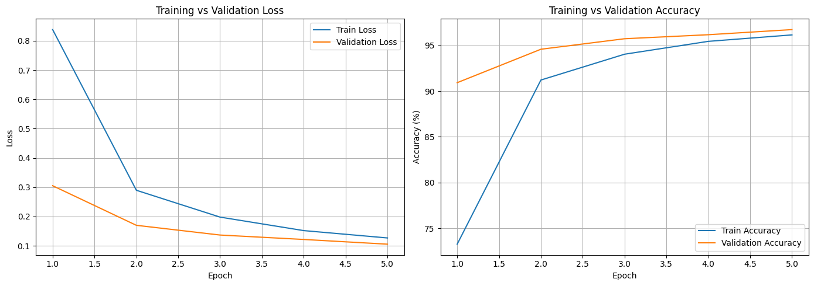
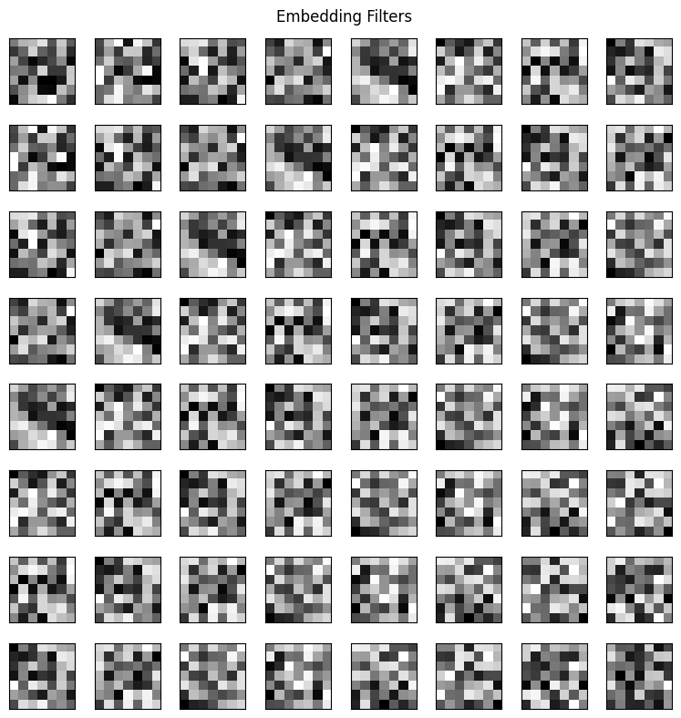
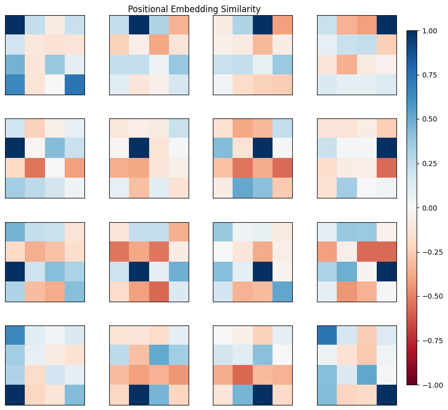

# The Annotated Vision Transformer

A line-by-line, runnable walkthrough of the Vision Transformer ([Dosovitskiy et al., 2020](https://arxiv.org/abs/2010.11929)), in the style of [The Annotated Transformer](https://nlp.seas.harvard.edu/2018/04/03/attention.html).

It covers patch and positional embeddings, the CLS token, the encoder block, and the training setup, then trains a small ViT on MNIST on CPU, fine-tunes it on Fashion-MNIST, and inspects what it learned.

**[Open the notebook](annotated-vision-transformer.ipynb)**

## Results

| Task | Test accuracy |
|---|---|
| Pretraining on MNIST (5 epochs, CPU) | 96.74% |
| Fine-tuning on Fashion-MNIST (5 epochs) | 85.05% |

<p align="center">
  
</p>
<p align="center">
  
  
</p>

## Usage

```bash
pip install -r requirements.txt
jupyter notebook annotated-vision-transformer.ipynb
```

Runs on CPU; MNIST and Fashion-MNIST download automatically.
